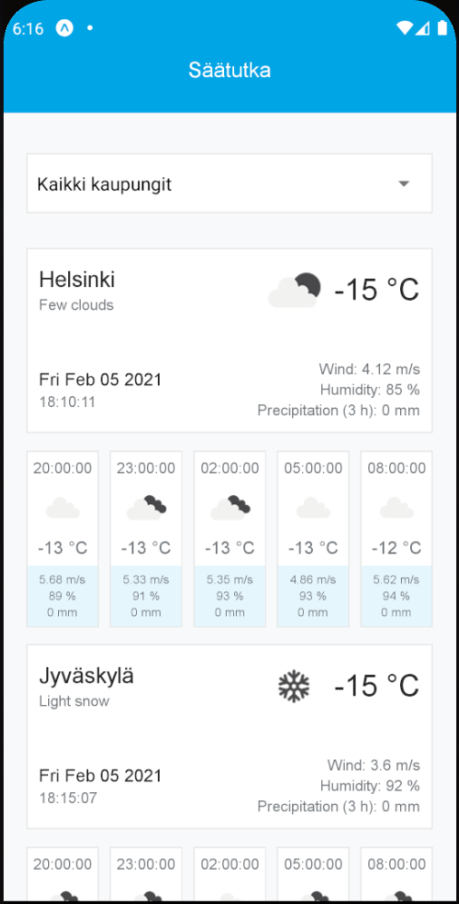

# Säätutka

Etteplan MOREn front-end -ennakkotehtävä.

Sovelluksessa esitetään MOREn toimistojen sijaintien säätiedot sekä ennusteet. Ennusteet näytetään kolmen tunnin aikaväleillä.

## Ajaminen

Sovellus on toteutettu [react-native](https://reactnative.dev/docs/getting-started)lla [expo](https://docs.expo.io/) -alustalle. Kehittäessä on käytetty vain androidia.

1. Kloonaa repo omalle koneellesi
2. Aja `npm install` projektin juuressa
3. Aja `npm run start`

Saadaksesi säätiedot, sinun pitää luoda projektin juureen tiedosto `.env`, jonka sisälle tulee `API_KEY={API avaimesi}`.
